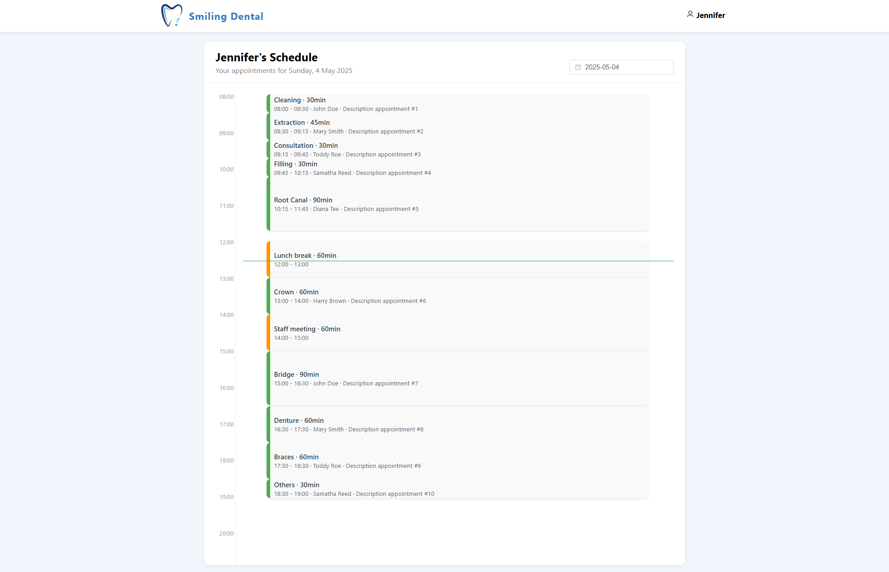

# Dental Clinic Management System

A full-stack application for managing dental clinic appointments, built with Spring Boot and Vue.js.

## Overview

This application allows:
- Patients to book dental appointments online
- Dentists to manage their schedules
- Automatic allocation of patients to available dentists
- Real-time availability tracking

## Application Interface

### Landing Page

*The landing page provides an overview of the dental clinic services and allows patients to book appointments. Link for dentist to access their schedules.*

### Appointment Booking

*Appointment booking interface where patients can select services and available time slots.*

### Login Page

*Login interface for dentists to access their schedules.*

### Dentist Schedule Management

*Dentists can view their daily schedules*

## Getting Started

### Required Software

1. **Java Development Kit (JDK) 24**
   - Download from: [Oracle JDK 24](https://www.oracle.com/sg/java/technologies/downloads/)
   - Verify: `java -version`

2. **Maven 3.8+**
   - Download from: [Maven Download](https://maven.apache.org/download.cgi)
   - Verify: `mvn -version`

3. **Node.js 22+ (LTS)**
   - Download from: [Node.js Download](https://nodejs.org/en/download/)
   - Verify: `node --version`

### Project Structure
```
dentalclinic/
├── backend/          # Spring Boot application
└── frontend/         # Vue.js application
```

## Setup Instructions

### Backend Setup
1. Navigate to backend:
   ```bash
   cd backend
   ```

2. Build project:
   ```bash
   mvn clean install
   ```

3. Run application:
   ```bash
   mvn spring-boot:run
   ```
   Note: You can also run the backend using IntelliJ.

### Frontend Setup
1. Navigate to frontend:
   ```bash
   cd frontend
   ```

2. Install dependencies:
   ```bash
   npm install
   ```

3. Start development server:
   ```bash
   npm run dev
   ```

### Access Points
| Component     | URL                              |
|--------------|----------------------------------|
| Frontend     | http://localhost:5173            |
| Backend API  | http://localhost:8080/api        |
| Swagger UI   | http://localhost:8080/swagger-ui.html |
| DB Console   | http://localhost:8080/h2-console |

## System Features

### For Patients
- Book appointments by selecting:
  - Appointment type
  - Preferred date and time
  - Description
- Automatic assignment to available dentist
- Real-time availability checking
- Disabled slots for unavailable times/dates
   - Patients can only book 1 day in advanced 

### For Dentists
- Login system
- View daily schedules
- View unavailable periods

### Demo Login Credentials

| Username | Password |
|----------|----------|
| Jennifer | Jennifer |
| Michael  | Michael  |

### Available Services

| Service Type  | Duration (mins) |
|--------------|----------------|
| Cleaning     | 30            |
| Consultation | 30            |
| Filling      | 30            |
| Extraction   | 45            |
| Crown        | 60            |
| Denture      | 60            |
| Braces       | 60            |
| Root Canal   | 90            |
| Bridge       | 90            |
| Others       | 30            |